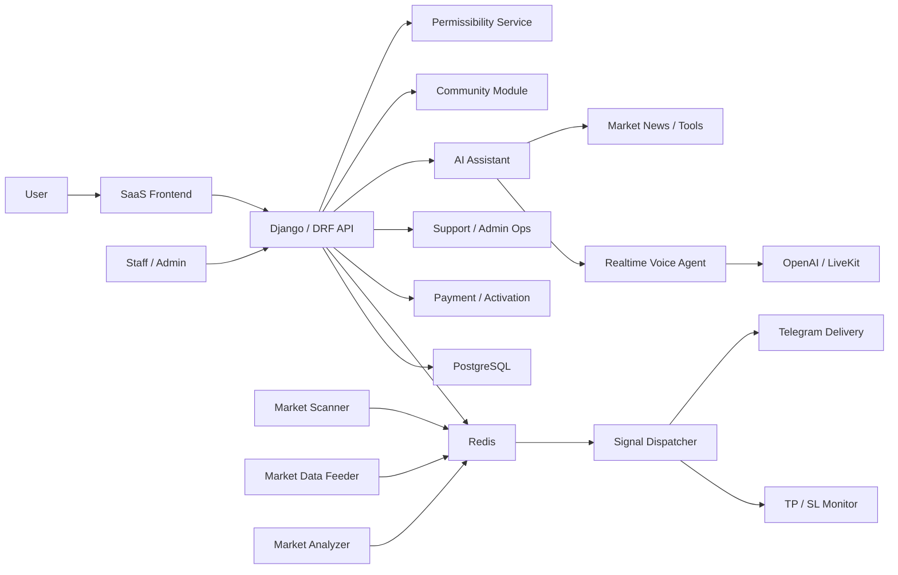

# Private AI Crypto Trading SaaS - NDA-Safe Case Study

> This public repository contains only a written case study.  
> The real production codebase is private because it was built for a client and includes confidential business logic, trading workflows, integration details, security-sensitive configuration, and NDA-protected implementation work.

## What This Project Is

This project is a full-stack AI crypto trading SaaS platform built as a private client product. It is not a simple bot, not a landing page, and not a small dashboard demo. It is a complete subscription-based platform where users can sign up, activate access, manage trading preferences, receive automated market signals, connect Telegram delivery, interact with an AI assistant, and use a polished web dashboard while multiple backend services run continuously in the background.

At a high level, the platform combines:

- A Django-based SaaS web application
- REST APIs for auth, payments, dashboard data, signals, AI tools, and admin operations
- Redis-backed realtime data and service coordination
- PostgreSQL-backed user, subscription, signal, support, and community data
- Long-running market scanner, dispatcher, monitor, scheduler, and Telegram services
- AI assistant features powered by OpenAI and realtime voice infrastructure
- Telegram bot automation for activation, delivery, reminders, and user communication
- Dockerized deployment with separate app, worker, database, cache, voice, analyzer, and proxy services

The public purpose of this repository is to document the engineering scope without exposing the private code.

## Why Source Code Is Not Public

The private repository contains client-owned and sensitive implementation details, including:

- Trading strategy logic
- Signal scoring and filtering rules
- Telegram delivery workflows
- AI assistant prompts, tools, and memory behavior
- User activation and subscription handling
- Payment and manual verification logic
- Deployment configuration and environment-specific settings
- Security-sensitive integration details

Publishing the code would break the trust boundary of the client project. This README is intentionally written as an NDA-safe technical case study.

## Private Codebase Scale

A recent internal snapshot of the private implementation includes approximately:

- 380+ Git-tracked files
- 240+ tracked code/config files
- 45k+ lines of code/config
- Multiple Django apps
- Multiple long-running backend services
- Docker-based service orchestration
- API, frontend, realtime, AI, Telegram, market-data, and operations layers

These numbers are approximate and included only to communicate project scope. The source code itself is not included here.

## Main Feature Set

### 1. SaaS Website & Product Frontend

The platform includes a complete web-facing product experience:

- Homepage and product explanation pages
- Pricing page
- Checkout flow
- Purchase success flow
- Manual payment success flow
- FAQ page
- Contact/support page
- Refund policy page
- Performance page
- AI feature page
- Shariah/permissibility feature page
- Responsive templates for desktop and mobile
- Polished user-facing UI for a premium crypto SaaS product

The frontend is not only marketing content. It connects into real user flows such as registration, login, activation, checkout, dashboard access, Telegram settings, AI assistant access, and subscription state.

### 2. Authentication & Account Management

The project includes a custom user system and authentication flows:

- Email-based signup
- OTP/email verification
- Login/logout
- Password reset
- Password change
- Current-user API
- User profile fields
- Avatar and banner support
- Region/date-of-birth style profile metadata
- Referral-code style user metadata
- JWT-compatible authentication refresh flow

The authentication layer is connected to subscription access, activation keys, dashboard state, Telegram delivery state, and admin views.

### 3. Subscription & Activation System

The platform supports paid access and activation-key based entitlement management:

- Subscription model per user
- Multiple duration options
- Active/inactive subscription status
- Expiry tracking
- Activation key validation
- Pre-generated activation key pool
- Admin key generation
- Manual key sending
- Dashboard access validation
- Subscription expiry service
- Payment order tracking
- Payment status tracking

This lets the platform behave like a real commercial SaaS product rather than a free demo dashboard.

### 4. Payment & Manual Verification Flow

The payment side includes both automated and manual paths:

- Payment initiation API
- Payment webhook endpoint
- Manual payment proof upload
- Screenshot/proof storage flow
- Staff approval endpoint
- User purchase order records
- Transaction ID tracking
- Payment status lifecycle: pending, verifying, completed, failed
- Email-style notification support for purchase and manual verification states

This was designed for practical client operations where not every payment path is fully automatic.

### 5. User Dashboard

The dashboard provides the authenticated user experience:

- Subscription-aware dashboard access
- Signal overview
- Performance metrics
- Risk configuration controls
- Trading signal history
- Chart data APIs
- Trade marker APIs
- Telegram delivery status
- AI assistant entry points
- User-specific data separation

The dashboard is connected to backend APIs and private service outputs instead of being only static UI.

### 6. Admin / Staff Dashboard

The admin side supports operational management:

- Staff-only dashboard route
- User management
- User deletion endpoint
- User subscription visibility
- Manual payment approval
- Activation key generation
- Manual activation key sending
- User conversation lookup
- Support ticket visibility
- Platform metrics and operational data

This gives non-developer operators a way to manage the SaaS without directly touching the database or backend services.

### 7. Trading Signals System

The core trading layer is built around structured signal generation, persistence, and user delivery:

- Trading pair model
- Active/inactive market pairs
- Sector metadata
- Long/short signal support
- Strategy label per signal
- Entry price levels
- Stop loss tracking
- Multiple take-profit levels
- Signal status: active, closed, cancelled
- Triggered TP tracking
- Close reason tracking
- Current price updates
- PnL and PnL percentage tracking
- Per-user signal uniqueness
- Signal history APIs

The public README does not disclose the private trading logic, but the system was built to support real signal lifecycle management rather than simple alert text.

### 8. Risk Management

Users can have individual risk settings:

- Account equity
- Risk per trade
- Maximum daily loss
- Maximum open trades
- Leverage setting
- Per-user risk configuration model
- API-backed create/update behavior
- Risk context available to AI assistant tooling

This allows trading outputs and assistant responses to be aware of user-specific constraints.

### 9. Market Data & Scanner Services

The private backend includes long-running services that keep the trading system active:

- OHLCV data feeder
- Market scanner
- Signal dispatcher
- Trade monitor
- Watchdog service
- Market analyzer service
- Redis-backed market data cache
- Binance/ccxt-style market data tooling
- Sector/context support
- Analyzer outputs shared with dashboard and AI tools

These services run separately from the web server, which makes the system closer to a production architecture than a single-process web app.

### 10. Signal Dispatch & Monitoring

The signal flow is decoupled into multiple responsibilities:

- Scanner finds potential market opportunities
- Strategy layer produces structured signal data
- Dispatcher filters and routes signals
- Redis stores active service state
- Monitor watches TP/SL conditions
- Telegram sender delivers messages
- Database sync keeps user-facing records available
- Watchdog supervises service health

This separation made the system easier to operate, debug, and extend.

### 11. Telegram Automation

Telegram is a major part of the product, not just a notification add-on:

- Public activation bot
- Personal bot support
- User Telegram connection flow
- Telegram status API
- Telegram connect/disconnect APIs
- Telegram test message API
- Per-user Telegram delivery toggle
- Bot token storage state
- Bot name and username tracking
- Last delivery status
- Last delivery error
- Async Telegram delivery queue
- Signal delivery through Telegram
- AI-created reminders delivered through Telegram

The system supports both product activation and ongoing automated communication through Telegram.

### 12. AI Assistant

The AI assistant layer is integrated into the trading platform:

- Text assistant endpoint
- Voice-agent token endpoint
- LiveKit-based realtime voice workflow
- OpenAI-powered responses
- Speech-to-text support
- Text-to-speech support
- Tool calling support
- Market-context tools
- User risk-context awareness
- Conversation history handling
- Rate limiting
- Voice style handling
- AI news and market explanation features

The assistant is designed to work inside the product context instead of being a generic chatbot pasted onto the site.

### 13. AI Memory & Scheduled Tasks

The assistant includes persistence and reminder-style workflows:

- Long-term memory profile per user
- Conversation messages by session
- Voice/text/audio channel tracking
- Assistant mode tracking
- User preference storage
- Scheduled task model
- Reminder title/message/original request storage
- Timezone-aware scheduling
- Task status lifecycle: pending, processing, sent, failed, cancelled
- Delivery error tracking
- Telegram-based reminder delivery

This allows the AI layer to support ongoing user interactions rather than one-off prompts.

### 14. Market News & Fundamentals

The API layer includes market information endpoints:

- Public crypto news fetching
- News normalization
- Crypto tag guessing
- Article age parsing
- Market fundamentals endpoint
- AI-friendly compact market context
- External news verification workflow

This supports both frontend display and assistant responses with fresher market context.

### 15. Community / Social Module

The platform includes a social layer for users:

- Community feed
- Post creation
- Image posts
- Post detail pages
- Reposts
- Likes
- Threaded comments
- Follow/following system
- Notifications for activity
- Mentions/comments/likes/follows/reposts
- Direct messages
- Read/unread message tracking
- Profile pages
- Explore/people pages
- API viewsets for posts, comments, profiles, notifications, and messages
- WebSocket routing for realtime community behavior

This turns the product from a private dashboard into a broader user platform.

### 16. Support & User Communication

The product includes support workflows:

- Support ticket model
- Ticket reply model
- Staff/user reply distinction
- Ticket status tracking
- Admin notes per user
- Bot conversation logs
- Contact form style flows
- Email templates for account and payment events

These details matter because real SaaS products need operational support, not only core features.

### 17. Shariah / Coin Permissibility Module

The project also includes a separate permissibility/audit feature:

- Coin database handling
- Shariah/permissibility analysis module
- Audit endpoint
- Stats endpoint
- Dedicated frontend page
- Separate service container support
- Integration with the main platform

This feature was built as a domain-specific extension rather than a generic static page.

### 18. Deployment & Infrastructure

The project includes deployment-oriented infrastructure:

- Dockerfile setup
- Docker Compose orchestration
- PostgreSQL container
- Redis container
- Django web service
- Background services container
- Market analyzer service
- Voice-agent service
- Shariah module service
- Nginx reverse proxy
- Static/media volume handling
- Health checks
- Environment-based settings
- CI/CD workflow
- Production service entrypoint

The system was structured so the web app and background workers could run as separate services.

## High-Level Architecture

## Example User Journey

1. A user registers and verifies their email.
2. The user chooses a plan and completes payment or submits manual proof.
3. The platform assigns or validates an activation key.
4. The user gets dashboard access after subscription activation.
5. The user configures risk settings and Telegram delivery.
6. Market services continuously fetch, scan, filter, and monitor signals.
7. Valid signals are stored, tracked, and delivered to the user.
8. The user can view performance, chart data, and signal history.
9. The user can ask the AI assistant for market context or risk-aware explanations.
10. The user can schedule reminders that are delivered through Telegram.
11. Staff can manage users, keys, payments, support, and platform operations.

## My Role

I worked across the project end-to-end:

- Product architecture
- Django backend development
- REST API design
- Database models and relationships
- Frontend template and UI work
- User dashboard and admin dashboard flows
- Authentication and activation flows
- Subscription and payment logic
- Trading signal data modeling
- Redis-backed service coordination
- Market scanner/service orchestration
- Telegram bot automation
- AI assistant integration
- Voice-agent workflow
- Community/social module work
- Dockerized deployment structure
- Debugging, testing, and production hardening

This was a multi-layer engineering project where product thinking, backend systems, frontend UX, automation, AI, and infrastructure had to work together.

## Technical Stack

- Python
- Django
- Django REST Framework
- Django Channels
- PostgreSQL
- Redis
- Docker
- Docker Compose
- Nginx
- Telegram Bot API
- OpenAI APIs
- LiveKit
- ccxt / Binance market tooling
- pandas / numpy
- technical analysis libraries
- scikit-learn / joblib style ML tooling
- HTML
- CSS
- JavaScript

## Engineering Challenges

- Designing a SaaS system with multiple service layers
- Keeping the web app separate from long-running market workers
- Coordinating market data through Redis
- Managing signal lifecycle from generation to delivery to monitoring
- Handling user-specific subscriptions, activation, and expiry
- Supporting Telegram delivery without coupling every feature to Telegram directly
- Adding AI assistant features without exposing private strategy logic
- Making voice, text, memory, and reminders work inside one product context
- Building admin workflows for real operations
- Keeping frontend polished while preserving backend behavior
- Preparing the system for Dockerized deployment
- Protecting client-owned code and implementation details

## What This Case Study Demonstrates

This project demonstrates that I can build and reason about:

- Production-style SaaS platforms
- Complex Django applications
- Multi-service backend systems
- AI assistant integrations
- Realtime voice workflows
- Trading/market-data platforms
- Telegram automation
- Subscription and activation systems
- Admin operations tooling
- User dashboards
- Community features
- Dockerized deployment architecture
- Private-client engineering under NDA

## Confidentiality Statement

No proprietary source code, client secrets, trading algorithms, private prompts, datasets, API keys, deployment credentials, or private business logic are included in this repository.

I can discuss architecture, product scope, engineering decisions, and tradeoffs at a high level. I cannot publish or share the private implementation.

## Available For Similar Work

If you need help building a serious SaaS product, AI assistant, automation system, trading dashboard, Telegram integration, Django backend, or Dockerized multi-service platform, feel free to reach out.

I can help with:

- Full-stack SaaS development
- Django / DRF backend systems
- AI assistant and voice-agent integrations
- Telegram bot automation
- Realtime dashboards and data pipelines
- Trading-platform architecture
- Admin dashboards and internal tools
- Dockerized deployment architecture
- Private-client product development under NDA
